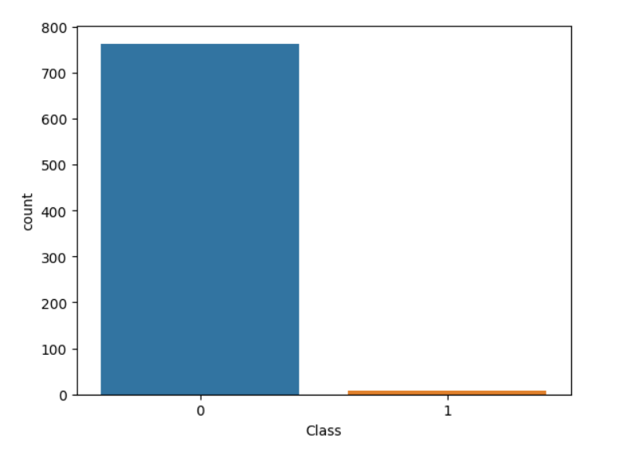
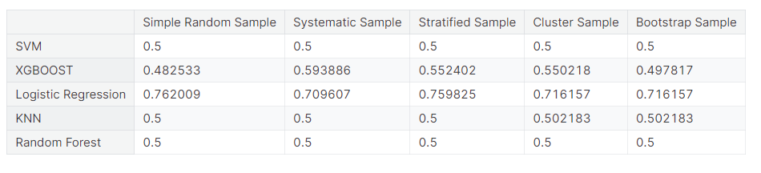

# SAMPLING_ASSIGNMENT

# Overview
## Sampling 

This repository contains Python code for implementing various sampling techniques on a credit card fraud dataset. The goal is to demonstrate how different sampling methods, specifically undersampling and oversampling, can be applied to balance imbalanced datasets.

## Dataset
The credit card fraud dataset used in this project is sourced from the following URL:
[Credit Card Fraud Dataset](https://github.com/AnjulaMehto/Sampling_Assignment/blob/main/Creditcard_data.csv)


The dataset consists of 772 rows and 31 columns, with features such as Time, V1-V28, Amount, and Class. The 'Class' column indicates whether a transaction is fraudulent (Class=1) or not (Class=0).

**Dependencies**
Before running the code, make sure to install the necessary Python libraries using the following:

```bash
pip install pandas numpy matplotlib
```

**Checking if Dataset is Balanced**
To check if the dataset is balanced or not, a bar graph is plotted using matplotlib.


<br/>

As we can see from the bar graph, the given dataset is not balanced so, we applied diffrent techniques for the same.


## Sampling

Jupyter Notebook demonstrates the creation of five different samples using various sampling techniques:<br/>
* **Simple Random Sampling:** Randomly selecting a specified number of instances from the dataset.<br/>
* **Stratified Sampling:** Creating samples from each class separately to maintain the original class distribution.<br/>
* **Cluster Sampling:** Dividing the dataset into clusters and selecting entire clusters randomly.<br/>
* **Systematic Sampling:** Selecting every k-th instance from the dataset.<br/>
* **Bootstrap Sampling:** Each bootstrap sample contains elements from both class 0 and class 1.<br/>

We applied the following models on our samples and calculated their acuuracies for each sample:<br/><br/>
1. Logistic Regression<br/>
2. SVM<br/>
3. KNN<br/>
4. XGBOOST<br/>
5. Random Forest<br/>

After that, we conducted an analysis wherein various models were applied to distinct samples, and subsequently, the accuracies for each model-sample combination were recorded and organized in a tabular format given below:<br/>

<br/>

## Conclusion


### 1.Simple Random Sampling:
Best Model: Logistic Regression

Accuracy: 0.762009


### 2.Systematic Sampling:
Best Model: Logistic Regression

Accuracy: 0.709607


### 3.Stratified Sampling:
Best Model: Logistic Regression

Accuracy: 0.759825


### 4.Cluster Sampling:
Best Model: Logistic Regression

Accuracy: 0.716157


### 5.Bootstrap Sampling:
Best Model: Logistic Regression

Accuracy: 0.716157


## Logistic Regression consistently achieved the highest accuracy across different sampling techniques.

